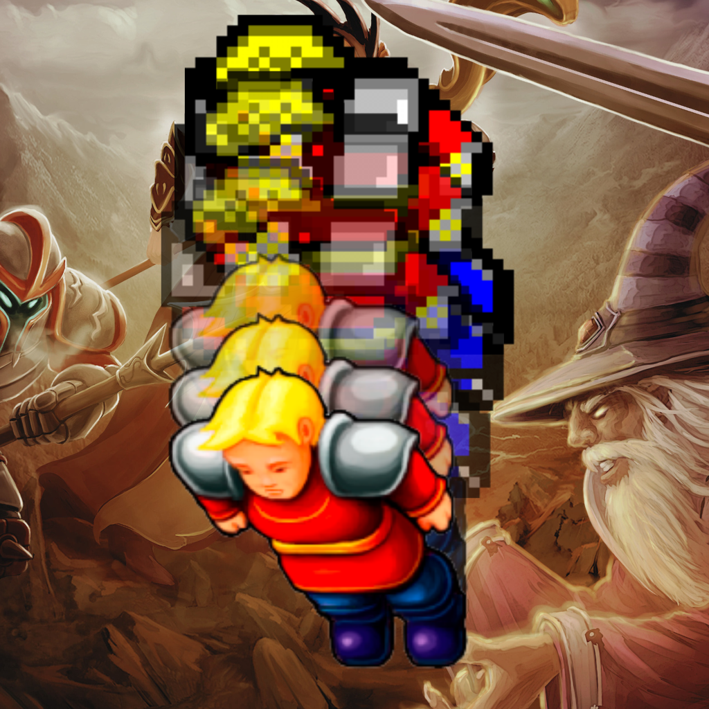

    

# Tibia More

 

Tibia More makes your Tibia life easier. With it, you'll be able to:

- Search on TibiaWiki
- Read the news ticker and also the latest news
- Search for characters, save the ones you like and see their details
- Check out Tibia worlds, their details and see who is online
- Have access to multiple Tibia utilities, like Rashid, highscores, spells, guilds, and so on...

 

## Check it out on Apple Store

Tibia More is available on Apple Store, [download it here](https://apps.apple.com/app/tibia-more/id6476467812)!

 

### Contribute

Please feel free to contribute with this repository, this project does not have profit purposes, so it will remain ad-free and free to charge forever.